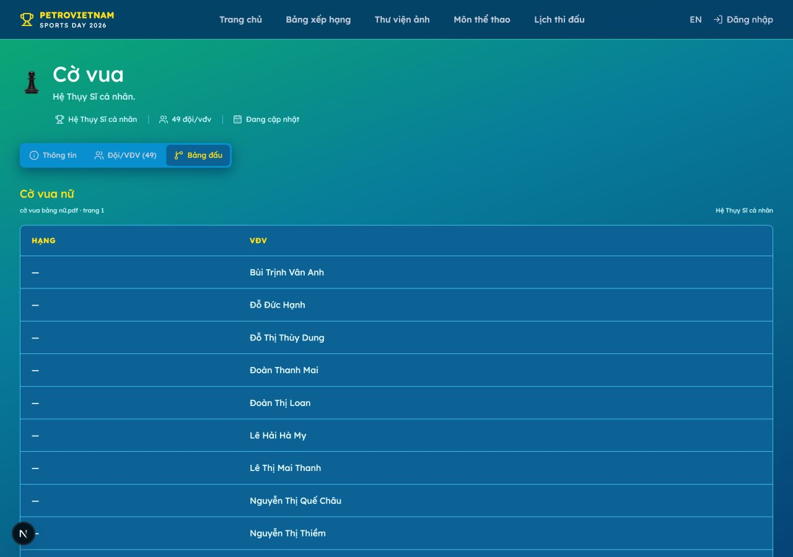

# Hướng dẫn vận hành Hội thao Petrovietnam 2026

> Bản hướng dẫn dành cho người xem website và admin. Không cần biết kỹ thuật. Chỉ cần làm theo thứ tự: **mở đúng trang → chọn đúng môn/hạng mục → đọc hoặc nhập dữ liệu → kiểm tra → lưu**.

## Mục lục

- [1. Hiểu nhanh website](#hieu-nhanh)
- [2. Người xem: xem lịch đấu](#xem-lich)
- [3. Người xem: xem kết quả và thứ hạng](#xem-ket-qua)
- [4. Admin: quy trình chung](#admin-chung)
- [5. Pickleball](#pickleball)
- [6. Bóng bàn](#bong-ban)
- [7. Cầu lông](#cau-long)
- [8. Bơi lội](#boi-loi)
- [9. Kéo co](#keo-co)
- [10. Điền kinh](#dien-kinh)
- [11. Cờ vua](#co-vua)
- [12. Cờ tướng](#co-tuong)
- [13. Checklist trước khi kết thúc](#checklist)
- [14. Khi có vấn đề](#xu-ly-loi)

## 1. Hiểu nhanh website

### Bạn muốn xem gì?

| Nhu cầu | Mở trang | Bạn sẽ thấy |
|---|---|---|
| Xem trận sắp diễn ra | [Lịch thi đấu](../schedule) | Ngày, giờ, môn, hạng mục, đội, địa điểm, trạng thái |
| Xem nhánh hoặc bảng đấu | [Môn thể thao](../sports) → chọn môn → **Bảng đấu** | Nhánh đấu, bảng điểm hoặc danh sách thành tích |
| Xem hạng các đơn vị | [Bảng xếp hạng](../leaderboard) | Hạng, vàng, bạc, đồng, tổng huy chương |
| Cập nhật dữ liệu | [Đăng nhập](../login) → **Admin** | Màn hình quản trị nội dung và thi đấu |

### Từ điển dễ hiểu

- **Môn thể thao**: Pickleball, Bóng bàn, Bơi lội…
- **Hạng mục**: nội dung thi đấu trong một môn, ví dụ “Đôi nam dưới 30 tuổi”.
- **Đội / cặp / VĐV**: người hoặc nhóm thực sự thi đấu.
- **Trận đấu**: một lần hai đội/cặp gặp nhau.
- **Bảng đấu**: nhiều đội/cặp thi đấu trong cùng một nhóm.
- **Nhánh đấu**: sơ đồ đấu loại; đội thắng đi tiếp theo mũi tên.
- **Hạng**: vị trí xếp do ban tổ chức công bố.
- **Đang cập nhật** hoặc dấu **—**: dữ liệu chưa được nhập, không phải lỗi website.

### Bốn môn có cách hiển thị riêng

**Cờ vua, Cờ tướng, Bơi lội, Điền kinh** không dùng lịch trận đối đầu trên trang lịch chung. Người xem mở trang môn và xem **Bảng đấu**. Admin nhập kết quả theo bảng riêng của từng môn.

## 2. Người xem: xem lịch đấu

Mở **Lịch thi đấu** trên menu hoặc vào [trang Lịch thi đấu](../schedule).

### Các bước

1. Chọn **Tất cả môn**, hoặc chọn một môn.
2. Chọn **hạng mục** nếu muốn thu hẹp kết quả.
3. Chọn **trạng thái**:
   - **Sắp diễn ra**: chưa bắt đầu.
   - **Đang diễn ra**: đang thi đấu.
   - **Đã kết thúc**: trận đã xong.
   - **Tạm hoãn / Đã huỷ**: không theo lịch cũ.
4. Đọc dòng trận cần tìm.

### Cách đọc một dòng

- **Giờ**: giờ Việt Nam.
- **Trận đấu**: tên hai đội/cặp. “Chưa xếp đội” nghĩa là ban tổ chức chưa điền đội.
- **Vòng**: vòng bảng, bán kết, chung kết…
- **Địa điểm / Sân / làn**: nơi thi đấu.
- **Kết quả**: tỷ số nếu đã có; nếu chưa thì đọc trạng thái.

### Hai cách xem

- Bấm **Theo lịch** để xem theo ngày và giờ.
- Bấm **Bảng đấu** để xem nhánh hoặc bảng của các hạng mục.
- Trên điện thoại, kéo ngang bảng nếu có nhiều cột.
- Muốn in: lọc dữ liệu trước, bấm **Xuất PDF**, rồi chọn **Save as PDF / Lưu thành PDF**.

## 3. Người xem: xem kết quả và thứ hạng

### Bảng xếp hạng đoàn

Mở [Bảng xếp hạng](../leaderboard).

- **Hạng**: thứ tự của đơn vị.
- **Vàng / Bạc / Đồng**: số huy chương từng loại.
- **Tổng**: tổng số huy chương đang hiển thị.
- Bảng chưa có dữ liệu sẽ báo “Bảng xếp hạng sẽ được cập nhật sau khi có kết quả”.

### Kết quả theo môn

1. Mở [Môn thể thao](../sports).
2. Chọn môn.
3. Chọn tab **Bảng đấu**.
4. Chọn đúng hạng mục.

Nhánh đấu đọc từ trái sang phải. Bảng vòng tròn đọc các cột **Hạng**, **Đội/VĐV**, **Điểm**. Tỷ số hoặc hạng là thông tin ban tổ chức đã nhập; không tự suy đoán khi còn dấu “—”.

### Nhận biết loại kết quả

- Môn đối đầu: xem đội/cặp, tỷ số, đội thắng và vòng tiếp theo.
- Bơi lội/Điền kinh: xem **Hạng, VĐV, Làn, Thành tích, Trạng thái**.
- Cờ vua/Cờ tướng: xem **Hạng, VĐV**. Website không tự dựng lịch ván cờ.

## 4. Admin: quy trình chung

### Đăng nhập

1. Mở **/login**.
2. Nhập tài khoản được cấp.
3. Bấm **Đăng nhập**.
4. Vào được Dashboard là đăng nhập thành công.

Không đưa mật khẩu vào tài liệu hoặc nhóm chat. Nếu bị chuyển về trang đăng nhập, đăng nhập lại; nếu vẫn không vào được, dừng thao tác và báo người phụ trách.

### Cách chọn đúng nơi cần sửa

1. Từ Dashboard, bấm đúng **môn**.
2. Chọn đúng **hạng mục**.
3. Chọn đúng khu vực:
   - **Hạng mục**: tên và thể thức.
   - **Đội & VĐV**: đội, cặp, cá nhân, thành viên.
   - **Lịch & trận**: địa điểm, sân, bảng, trận đối đầu.
   - **Kết quả**: tỷ số, hạng, điểm, huy chương.
   - **Thư viện**: media cũ; không dùng để upload gallery mới.
4. Mở đúng dòng, sửa, bấm nút **Lưu** của dòng đó.
5. Tải lại trang và kiểm tra dữ liệu đã lưu.

### Cập nhật bảng xếp hạng đoàn

Tại Dashboard, trong **Bảng xếp hạng đoàn**:

1. Tìm đúng đơn vị.
2. Nhập **Hạng**, **Vàng**, **Bạc**, **Đồng**.
3. Kiểm tra **Tổng**.
4. Bấm **Lưu BXH / Save leaderboard** sau khi nhập xong.

Tổng được tính từ ba loại huy chương. Không nhập số âm. Đơn vị chưa có hạng sẽ nằm cuối bảng.

### Cập nhật nội dung và ảnh

- Sửa tên, mô tả, địa điểm, thời gian hoặc liên kết Google Drive trong **Nội dung sự kiện**, rồi bấm **Lưu nội dung**.
- Link Drive phải là địa chỉ HTTPS của Google Drive.
- Gallery public mở thư mục Google Drive. Media cũ vẫn giữ nguyên; không upload ảnh gallery mới ở khu vực media cũ.

## 5. Pickleball

### Thể thức

Thi đấu **đôi**, chia theo giới tính và nhóm tuổi. Hạng mục có thể gồm vòng bảng và loại trực tiếp.

### Người xem mở ở đâu?

Mở [Môn thể thao](../sports) → **Pickleball**:

- **Lịch đấu**: xem giờ, địa điểm và các trận.
- **Bảng đấu**: xem bảng vòng loại và nhánh loại trực tiếp.
- Trên nhánh, mỗi thẻ là một trận; số bên phải là tỷ số.

### Admin cập nhật thế nào?

1. Vào **Đội & VĐV**, kiểm tra đúng cặp và thành viên.
2. Vào **Lịch & trận**, kiểm tra hạng mục, bảng, đội và giờ.
3. Vào **Kết quả**.
4. Bấm trực tiếp vào thẻ trận cần sửa trên nhánh.
5. Kiểm tra **Đội 1/Đội 2**, nhập **Tỷ số 1/Tỷ số 2**.
6. Chọn **Trạng thái** và **Đội thắng**.
7. Bấm **Lưu kết quả**.
8. Kiểm tra lại trận sau trên nhánh.

Kết quả hợp lệ sẽ đưa đội thắng vào ô trận sau. Chỉ sửa **Cấu trúc nhánh** trước khi hạng mục bắt đầu. Nếu sửa trận đã có trận sau, phải xem ảnh hưởng trước; không tự reset hàng loạt.

## 6. Bóng bàn

### Thể thức

Thi đấu **đôi nam, đôi nữ và đôi nam nữ** theo hạng mục tuổi. Hạng mục dùng vòng bảng và loại trực tiếp.

### Người xem

- Vào **Bóng bàn** → **Lịch đấu** để xem trận.
- Vào **Bảng đấu** để xem bảng và nhánh.
- Bảng vòng tròn đọc **Hạng, Đội/VĐV, Điểm**; nhánh đọc tỷ số và đội đi tiếp.

### Admin

- Đầu tiên kiểm tra đúng **cặp** và **hạng mục tuổi**.
- Trận loại trực tiếp: cập nhật như Pickleball — bấm thẻ trận, nhập hai tỷ số, trạng thái và đội thắng.
- Trận vòng bảng: nhập kết quả theo biên bản, sau đó mở bảng kết quả và nhập **Hạng, Điểm**.
- Bấm **Lưu bảng**; khi ban tổ chức chốt bảng, bấm **Xác nhận bảng**.

Không tự cộng điểm hoặc tự đổi thứ hạng nếu biên bản chưa có kết luận.

## 7. Cầu lông

### Thể thức

Thi đấu **đôi** theo giới tính và nhóm tuổi. Tùy hạng mục, hệ thống có thể dùng loại trực tiếp, vòng bảng hoặc vòng tròn.

### Người xem

- **Lịch đấu**: xem trận, giờ, sân và trạng thái.
- **Bảng đấu**: xem nhánh nếu là loại trực tiếp, hoặc bảng điểm nếu là vòng bảng/vòng tròn.
- Luôn chọn đúng hạng mục trước khi đọc kết quả.

### Admin

- Kiểm tra cặp và thành viên trong **Đội & VĐV**.
- Nếu thấy nhánh: cập nhật từng trận bằng tỷ số, trạng thái và đội thắng.
- Nếu thấy bảng: nhập **Hạng, Điểm**, lưu bảng, rồi xác nhận bảng khi đã chốt.
- Với hạng mục có nhiều kiểu thi đấu, không lấy quy tắc của hạng mục này áp dụng cho hạng mục khác.

## 8. Bơi lội

### Thể thức

Gồm nội dung cá nhân 50m, 100m và tiếp sức 4×50m. Kết quả xếp theo thành tích thời gian.

### Người xem

Mở **Bơi lội** → **Bảng đấu**. Đọc:

**Hạng → VĐV → Làn → Thành tích → Trạng thái**.

Môn này không có lịch trận đối đầu trên trang lịch chung.

### Admin

1. Vào **Đội & VĐV**, kiểm tra đúng VĐV hoặc đội tiếp sức.
2. Vào **Kết quả**.
3. Ở đúng hạng mục, nhập **Hạng, Làn, Thành tích, Trạng thái**.
4. Bấm **Lưu kết quả**.
5. Mở trang public và kiểm tra lại bảng.

Không tự đổi thời gian thành điểm, không tự xếp hạng khi chưa có biên bản.

## 9. Kéo co

### Thể thức

Thi đấu **đồng đội nam và nữ**, các đội đối đầu trực tiếp theo nhánh loại.

### Người xem

- **Lịch đấu**: xem đội, giờ, địa điểm và trạng thái.
- **Bảng đấu**: xem nhánh và đội thắng đi tiếp.

### Admin

1. Kiểm tra đội trong **Đội & VĐV**.
2. Kiểm tra trận trong **Lịch & trận**.
3. Vào **Kết quả**, bấm trận cần cập nhật.
4. Nhập tỷ số, trạng thái và đội thắng.
5. Bấm **Lưu kết quả**, rồi kiểm tra nhánh sau.

Không chọn nhầm đội nam/nữ và không sửa cấu trúc nhánh sau khi giải đã bắt đầu.

## 10. Điền kinh

### Thể thức

Gồm các cự ly cá nhân và tiếp sức 4×100m. Xếp hạng theo thời gian hoàn thành.

### Người xem

Mở **Điền kinh** → **Bảng đấu**. Đọc năm cột:

**Hạng → VĐV → Làn → Thành tích → Trạng thái**.

Không tìm môn này trong lịch trận đối đầu.

### Admin

1. Vào **Đội & VĐV**, kiểm tra đúng VĐV hoặc đội tiếp sức.
2. Vào **Kết quả**.
3. Nhập **Hạng, Làn, Thành tích, Trạng thái** theo biên bản.
4. Bấm **Lưu kết quả**.
5. Kiểm tra lại trang public.

Không tự quy đổi thành tích thành điểm và không tự đổi hạng.

## 11. Cờ vua

### Thể thức

Thi đấu cá nhân theo **hệ Thụy Sĩ**, chia theo nữ, nam dưới 45 tuổi và nam trên 45 tuổi.

### Người xem

Mở **Cờ vua** → **Bảng đấu**. Trang public hiển thị **Hạng** và **VĐV**. Website không dựng lịch ván cờ đối đầu.

### Admin

1. Vào **Đội & VĐV**, kiểm tra danh sách VĐV và hạng mục tuổi/giới tính.
2. Vào **Kết quả**.
3. Nhập **Hạng** và **Điểm** theo biên bản tổng hợp.
4. Bấm **Lưu bảng**.
5. Kiểm tra public chỉ hiển thị đúng VĐV và Hạng.

Không tự ghép cặp, không tự tính hệ số phụ và không tự đổi hạng.

## 12. Cờ tướng

### Thể thức

Thi đấu cá nhân theo **hệ Thụy Sĩ**, gồm nam dưới 45 tuổi và nam trên 45 tuổi.

### Người xem

Mở **Cờ tướng** → **Bảng đấu**. Đọc **Hạng** và **VĐV**. Không tìm lịch trận đối đầu ở trang lịch chung.

### Admin

1. Kiểm tra đúng VĐV và hạng mục tuổi.
2. Vào **Kết quả**.
3. Nhập **Hạng** và **Điểm** theo biên bản.
4. Bấm **Lưu bảng**.
5. Tải lại trang và kiểm tra public.

Không tự tính thắng–hòa–thua, hệ số phụ hoặc hạng cuối cùng.

## 13. Checklist trước khi kết thúc

- [ ] Đúng website **Petrovietnam 2026**.
- [ ] Đúng môn.
- [ ] Đúng hạng mục.
- [ ] Đúng đội/cặp/VĐV.
- [ ] Tỷ số không âm và chọn đúng đội thắng.
- [ ] Môn Bơi lội/Điền kinh đã nhập đủ Hạng, Làn, Thành tích, Trạng thái.
- [ ] Môn Cờ vua/Cờ tướng đã nhập Hạng và Điểm theo biên bản.
- [ ] Đã bấm nút **Lưu**.
- [ ] Đã tải lại trang để kiểm tra.
- [ ] Đã mở trang public để xác nhận.
- [ ] Nếu sửa kết quả đã đẩy vòng sau, đã được ban tổ chức xác nhận.

## 14. Khi có vấn đề

| Hiện tượng | Việc cần làm |
|---|---|
| Không thấy môn/hạng mục | Đặt lại bộ lọc; kiểm tra đúng URL và tab |
| Không thấy Lịch & trận | Có thể đang xem Bơi lội, Điền kinh, Cờ vua hoặc Cờ tướng |
| Có dấu “—” | Dữ liệu chưa được nhập hoặc chưa đủ điều kiện hiển thị |
| Kết quả sai sau khi lưu | Dừng sửa tiếp, ghi lại môn/hạng mục/trận và báo người phụ trách |
| Muốn sửa trận đã đẩy sang vòng sau | Xem ảnh hưởng trước; chỉ reset khi có xác nhận |
| Trang báo không tải được dữ liệu | Tải lại một lần; nếu còn lỗi, chụp màn hình và dừng cập nhật |

Khi báo lỗi, gửi đủ **môn, hạng mục, trận/bảng, thời điểm, ảnh màn hình và thao tác vừa làm**.

[↑ Về mục lục](#muc-luc)
