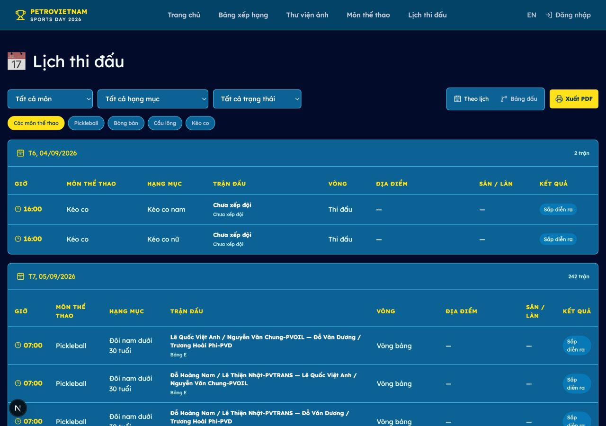
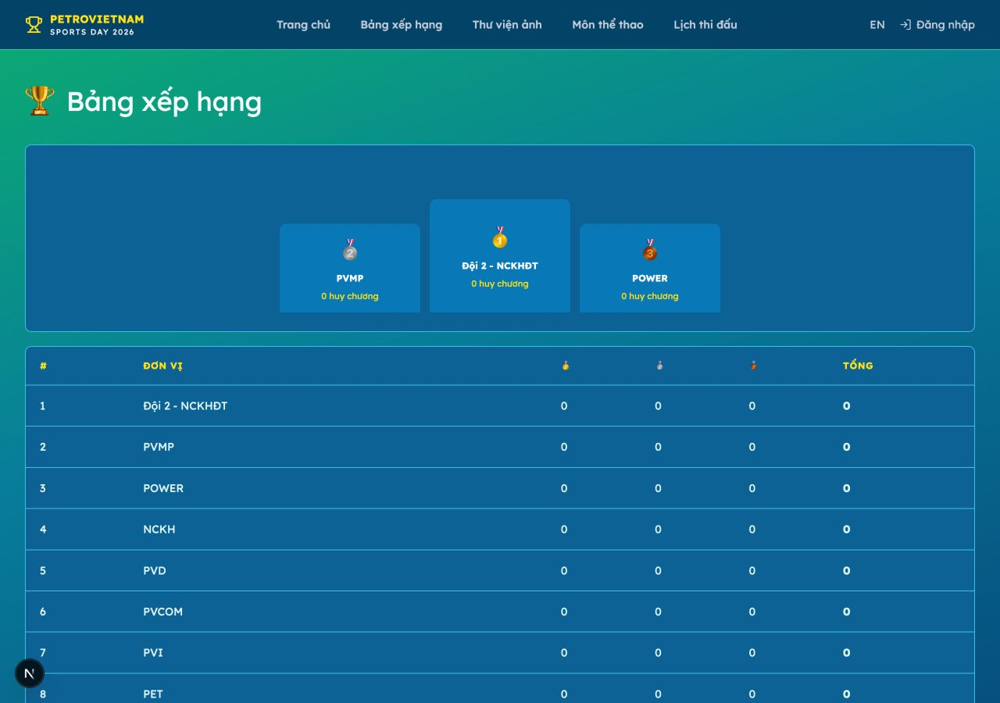
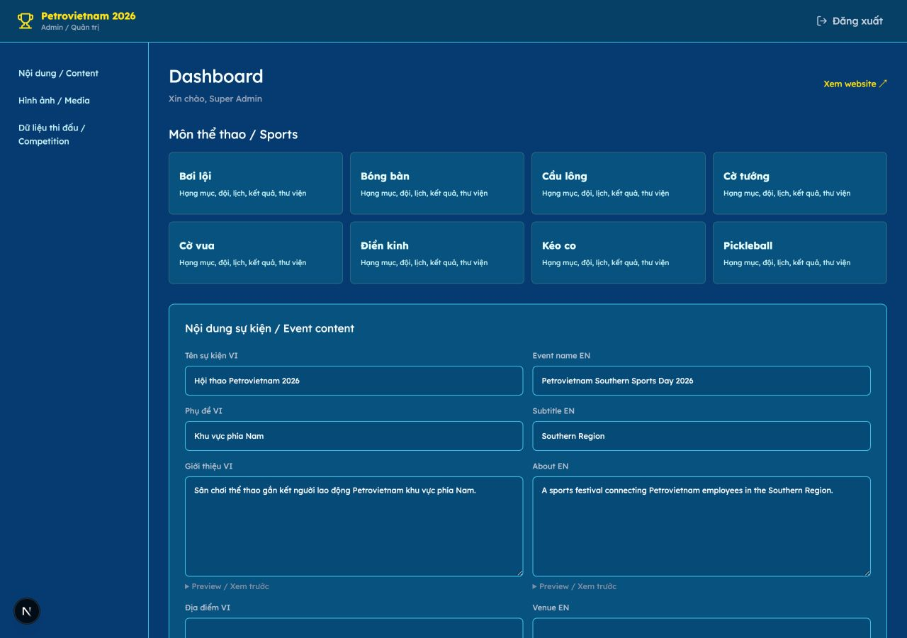
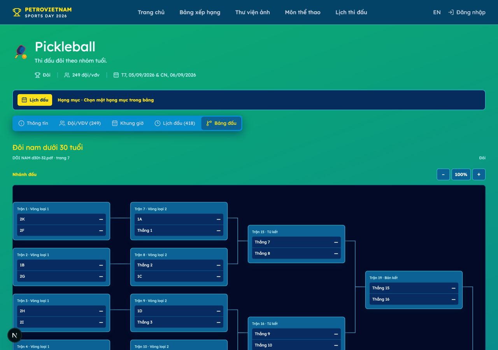
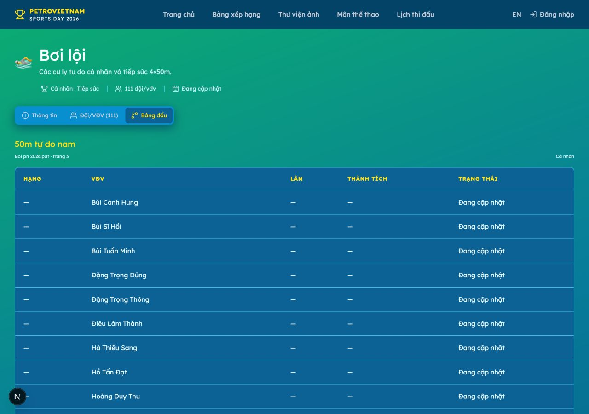

# Hướng dẫn vận hành Hội thao PTSC 2026

> Bản hướng dẫn dành cho người xem website và admin. Không cần biết kỹ thuật. Chỉ cần làm theo thứ tự: **mở đúng trang → chọn đúng môn/hạng mục → đọc hoặc nhập dữ liệu → kiểm tra → lưu**.

## Mục lục

- [1. Hiểu nhanh website](#hieu-nhanh)
- [2. Người xem: xem lịch đấu](#xem-lich)
- [3. Người xem: xem kết quả và thứ hạng](#xem-ket-qua)
- [4. Admin: quy trình chung](#admin-chung)
- [5. Pickleball PTSC](#pickleball)
- [6. Pickleball lãnh đạo PTSC](#pickleball-lanh-dao)
- [7. Bóng bàn](#bong-ban)
- [8. Cầu lông](#cau-long)
- [9. Tennis](#tennis)
- [10. Điền kinh](#dien-kinh)
- [11. Bơi lội](#boi-loi)
- [12. Kéo co](#keo-co)
- [13. Bóng đá nữ](#bong-da-nu)
- [14. Bóng đá nam A](#bong-da-nam-a)
- [15. Bóng đá nam B](#bong-da-nam-b)
- [16. Import workbook tổng](#import-workbook)
- [17. Checklist trước khi kết thúc](#checklist)
- [18. Khi có vấn đề](#xu-ly-loi)

## 1. Hiểu nhanh website

### Bạn muốn xem gì?

| Nhu cầu | Mở trang | Bạn sẽ thấy |
|---|---|---|
| Xem trận sắp diễn ra | [Lịch thi đấu](../schedule) | Ngày, giờ, môn, hạng mục, đội, địa điểm, trạng thái |
| Xem nhánh hoặc bảng đấu | [Môn thể thao](../sports) → chọn môn → **Bảng đấu** | Nhánh đấu, bảng điểm hoặc danh sách thành tích |
| Xem hạng các đơn vị | [Bảng xếp hạng](../leaderboard) | Hạng, vàng, bạc, đồng, tổng huy chương |
| Cập nhật dữ liệu | [Đăng nhập](../login) → **Admin** | Màn hình quản trị nội dung và thi đấu |

### Từ điển dễ hiểu

- **Môn thể thao**: Pickleball PTSC, Pickleball lãnh đạo PTSC, Bóng bàn, Cầu lông, Tennis, Điền kinh, Bơi lội, Kéo co, Bóng đá nữ, Bóng đá nam A hoặc B.
- **Hạng mục**: nội dung thi đấu trong một môn, ví dụ “Đôi nam từ 46 tuổi trở lên”.
- **Đội / cặp / VĐV**: người hoặc nhóm thực sự thi đấu.
- **Trận đấu**: một lần hai đội/cặp gặp nhau.
- **Bảng đấu**: nhiều đội/cặp thi đấu trong cùng một nhóm.
- **Nhánh đấu**: sơ đồ đấu loại; đội thắng đi tiếp theo mũi tên.
- **Hạng**: vị trí xếp do ban tổ chức công bố.
- **Đang cập nhật** hoặc dấu **—**: dữ liệu chưa được nhập, không phải lỗi website.

### Hai môn có cách hiển thị riêng

**Điền kinh và Bơi lội** không dùng lịch trận đối đầu trên trang lịch chung. Người xem mở trang môn và xem **Bảng đấu**. Admin nhập **Hạng, VĐV/đội + Đơn vị, Thành tích, Trạng thái**.

## 2. Người xem: xem lịch đấu

Mở **Lịch thi đấu** trên menu hoặc vào [trang Lịch thi đấu](../schedule).

### Các bước

1. Chọn **Tất cả môn**, hoặc chọn một môn.
2. Chọn **hạng mục** nếu muốn thu hẹp kết quả.
3. Chọn **trạng thái**:
   - **Sắp diễn ra**: chưa bắt đầu.
   - **Đang diễn ra**: đang thi đấu.
   - **Đã kết thúc**: trận đã xong.
   - **Tạm hoãn / Đã huỷ**: không theo lịch cũ.
4. Đọc dòng trận cần tìm.

### Cách đọc một dòng

- **Giờ**: giờ Việt Nam.
- **Trận đấu**: tên hai đội/cặp. “Chưa xếp đội” nghĩa là ban tổ chức chưa điền đội.
- **Vòng**: vòng bảng, bán kết, chung kết…
- **Địa điểm / Sân / làn**: nơi thi đấu.
- **Kết quả**: tỷ số nếu đã có; nếu chưa thì đọc trạng thái.

### Hai cách xem

- Bấm **Theo lịch** để xem theo ngày và giờ.
- Bấm **Bảng đấu** để xem nhánh hoặc bảng của các hạng mục.
- Trên điện thoại, kéo ngang bảng nếu có nhiều cột.
- Muốn in: lọc dữ liệu trước, bấm **Xuất PDF**, rồi chọn **Save as PDF / Lưu thành PDF**.

## 3. Người xem: xem kết quả và thứ hạng

### Bảng xếp hạng đoàn

Mở [Bảng xếp hạng](../leaderboard).

- **Hạng**: thứ tự của đơn vị.
- **Vàng / Bạc / Đồng**: số huy chương từng loại.
- **Tổng**: tổng số huy chương đang hiển thị.
- Bảng chưa có dữ liệu sẽ báo “Bảng xếp hạng sẽ được cập nhật sau khi có kết quả”.

### Kết quả theo môn

1. Mở [Môn thể thao](../sports).
2. Chọn môn.
3. Chọn tab **Bảng đấu**.
4. Chọn đúng hạng mục.

Nhánh đấu đọc từ trái sang phải. Bảng vòng tròn đọc các cột **Hạng**, **Đội/VĐV**, **Điểm**. Tỷ số hoặc hạng là thông tin ban tổ chức đã nhập; không tự suy đoán khi còn dấu “—”.

### Nhận biết loại kết quả

- Môn đối đầu: xem đội/cặp, tỷ số, đội thắng và vòng tiếp theo.
- Bơi lội/Điền kinh: xem **Hạng, VĐV/đội + Đơn vị, Thành tích, Trạng thái**.

## 4. Admin: quy trình chung

### Đăng nhập

1. Mở **/login**.
2. Nhập tài khoản được cấp.
3. Bấm **Đăng nhập**.
4. Vào được Dashboard là đăng nhập thành công.

Không đưa mật khẩu vào tài liệu hoặc nhóm chat. Nếu bị chuyển về trang đăng nhập, đăng nhập lại; nếu vẫn không vào được, dừng thao tác và báo người phụ trách.

### Cách chọn đúng nơi cần sửa

1. Từ Dashboard, bấm đúng **môn**.
2. Chọn đúng **hạng mục**.
3. Chọn đúng khu vực:
   - **Hạng mục**: tên và thể thức.
   - **Đội & VĐV**: đội, cặp, cá nhân, thành viên.
   - **Lịch & trận**: địa điểm, sân, bảng, trận đối đầu.
   - **Kết quả**: tỷ số, hạng, điểm, huy chương.
   - **Thư viện**: media cũ; không dùng để upload gallery mới.
4. Mở đúng dòng, sửa, bấm nút **Lưu** của dòng đó.
5. Tải lại trang và kiểm tra dữ liệu đã lưu.

### Cập nhật bảng xếp hạng đoàn

Tại Dashboard, trong **Bảng xếp hạng đoàn**:

1. Tìm đúng đơn vị.
2. Nhập **Hạng**, **Vàng**, **Bạc**, **Đồng**.
3. Kiểm tra **Tổng**.
4. Bấm **Lưu BXH / Save leaderboard** sau khi nhập xong.

Tổng được tính từ ba loại huy chương. Không nhập số âm. Đơn vị chưa có hạng sẽ nằm cuối bảng.

### Cập nhật nội dung và ảnh

- Sửa tên, mô tả, địa điểm, thời gian hoặc liên kết Google Drive trong **Nội dung sự kiện**, rồi bấm **Lưu nội dung**.
- Link Drive phải là địa chỉ HTTPS của Google Drive.
- Gallery public mở thư mục Google Drive. Media cũ vẫn giữ nguyên; không upload ảnh gallery mới ở khu vực media cũ.

## 5. Pickleball PTSC

### Thể thức

Thi đấu **đơn và đôi**, chia theo giới tính và nhóm tuổi. Hạng mục có thể gồm vòng A–H, vòng bảng, vòng tròn hoặc loại trực tiếp theo nguồn.

### Người xem mở ở đâu?

Mở [Môn thể thao](../sports) → **Pickleball PTSC**:

- **Lịch đấu**: xem giờ, địa điểm và các trận.
- **Bảng đấu**: xem bảng vòng loại và nhánh loại trực tiếp.
- Trên nhánh, mỗi thẻ là một trận; số bên phải là tỷ số.

### Admin cập nhật thế nào?

1. Vào **Đội & VĐV**, kiểm tra đúng VĐV/cặp và thành viên.
2. Vào **Lịch & trận**, kiểm tra hạng mục, bảng, đội và giờ.
3. Vào **Kết quả**.
4. Bấm trực tiếp vào thẻ trận cần sửa trên nhánh.
5. Kiểm tra **Đội 1/Đội 2**, nhập **Tỷ số 1/Tỷ số 2**.
6. Chọn **Trạng thái** và **Đội thắng**.
7. Bấm **Lưu kết quả**.
8. Kiểm tra lại trận sau trên nhánh.

Kết quả hợp lệ sẽ đưa đội thắng vào ô trận sau. Hạng mục **Đôi nam từ 46 tuổi trở lên** đang chờ xác nhận do sơ đồ nguồn trùng Seed 7; không tự sửa nhánh. Các ô Pickleball chưa có tên giữ trạng thái **Chờ nhập**, không xem là trùng dữ liệu.

## 6. Pickleball lãnh đạo PTSC

Đây là môn riêng, không gộp với Pickleball PTSC. Gồm **Đôi nam lãnh đạo** và **Đôi nam nữ lãnh đạo**. Vào đúng tab **Pickleball lãnh đạo PTSC**, kiểm tra cặp, bảng, nhánh và kết quả theo biên bản. Không dùng danh sách hoặc nhánh của Pickleball PTSC.

## 7. Bóng bàn

### Thể thức

Thi đấu **đơn nam, đơn nữ, đôi nam và đôi nam nữ** theo hạng mục tuổi. Hạng mục dùng vòng bảng và loại trực tiếp.

### Người xem

- Vào **Bóng bàn** → **Lịch đấu** để xem trận.
- Vào **Bảng đấu** để xem bảng và nhánh.
- Bảng vòng tròn đọc **Hạng, Đội/VĐV, Điểm**; nhánh đọc tỷ số và đội đi tiếp.

### Admin

- Đầu tiên kiểm tra đúng **VĐV/cặp** và **hạng mục tuổi**.
- Trận loại trực tiếp: cập nhật như Pickleball — bấm thẻ trận, nhập hai tỷ số, trạng thái và đội thắng.
- Trận vòng bảng: nhập kết quả theo biên bản, sau đó mở bảng kết quả và nhập **Hạng, Điểm**.
- Bấm **Lưu bảng**; khi ban tổ chức chốt bảng, bấm **Xác nhận bảng**.

Không tự cộng điểm hoặc tự đổi thứ hạng nếu biên bản chưa có kết luận.

## 8. Cầu lông

### Thể thức

Thi đấu **đơn và đôi** theo giới tính và nhóm tuổi. Tùy hạng mục, hệ thống có thể dùng loại trực tiếp, vòng bảng hoặc vòng tròn.

### Người xem

- **Lịch đấu**: xem trận, giờ, sân và trạng thái.
- **Bảng đấu**: xem nhánh nếu là loại trực tiếp, hoặc bảng điểm nếu là vòng bảng/vòng tròn.
- Luôn chọn đúng hạng mục trước khi đọc kết quả.

### Admin

- Kiểm tra cặp và thành viên trong **Đội & VĐV**.
- Nếu thấy nhánh: cập nhật từng trận bằng tỷ số, trạng thái và đội thắng.
- Nếu thấy bảng: nhập **Hạng, Điểm**, lưu bảng, rồi xác nhận bảng khi đã chốt.
- Với hạng mục có nhiều kiểu thi đấu, không lấy quy tắc của hạng mục này áp dụng cho hạng mục khác.

## 11. Bơi lội

### Thể thức

Gồm ba nội dung cá nhân và một nội dung đồng đội theo workbook PTSC. Kết quả xếp theo thành tích nguồn.

### Người xem

Mở **Bơi lội** → **Bảng đấu**. Đọc:

**Hạng → VĐV/đội + Đơn vị → Thành tích → Trạng thái**.

Môn này không có lịch trận đối đầu trên trang lịch chung.

### Admin

1. Vào **Đội & VĐV**, kiểm tra đúng VĐV hoặc đội.
2. Vào **Kết quả**.
3. Ở đúng hạng mục, nhập **Hạng, Thành tích, Trạng thái**.
4. Bấm **Lưu kết quả**.
5. Mở trang public và kiểm tra lại bảng.

Không tự đổi thời gian thành điểm, không tự xếp hạng khi chưa có biên bản.

## 12. Kéo co

### Thể thức

Thi đấu **đồng đội nam và nữ**, các đội đối đầu trực tiếp theo nhánh loại.

### Người xem

- **Lịch đấu**: xem đội, giờ, địa điểm và trạng thái.
- **Bảng đấu**: xem nhánh và đội thắng đi tiếp.

### Admin

1. Kiểm tra đội trong **Đội & VĐV**.
2. Kiểm tra trận trong **Lịch & trận**.
3. Vào **Kết quả**, bấm trận cần cập nhật.
4. Nhập tỷ số, trạng thái và đội thắng.
5. Bấm **Lưu kết quả**, rồi kiểm tra nhánh sau.

Không chọn nhầm đội nam/nữ và không sửa cấu trúc nhánh sau khi giải đã bắt đầu.

## 10. Điền kinh

### Thể thức

Gồm chín cự ly theo nhóm tuổi. Xếp hạng theo thành tích nguồn.

### Người xem

Mở **Điền kinh** → **Bảng đấu**. Đọc bốn trường:

**Hạng → VĐV + Đơn vị → Thành tích → Trạng thái**.

Không tìm môn này trong lịch trận đối đầu.

### Admin

1. Vào **Đội & VĐV**, kiểm tra đúng VĐV.
2. Vào **Kết quả**.
3. Nhập **Hạng, Thành tích, Trạng thái** theo biên bản.
4. Bấm **Lưu kết quả**.
5. Kiểm tra lại trang public.

Không tự quy đổi thành tích thành điểm và không tự đổi hạng.

## 9. Tennis

Tennis có bốn hạng mục đơn/đôi nam. Với hạng mục đôi nam 46+, dùng mã chuẩn **TEN-DOI-NAM46**; mã cũ `TEN-DOI-NAM46-CHECK` chỉ là alias import, không tạo hạng mục thứ hai.

Vào **Bảng đấu** để xem bảng/nhánh và vào **Kết quả** để nhập tỷ số, trạng thái và đội thắng theo biên bản. Không tự tạo lịch, sân hoặc kết quả.

## 13. Bóng đá nữ

Bóng đá nữ có một bảng năm đội. Vào **Bảng đấu** để xem vòng tròn và **Lịch đấu** để xem các trận đã có nguồn. Chỉ nhập lịch, địa điểm và kết quả khi Ban Tổ chức đã cung cấp.

## 14. Bóng đá nam A

Bóng đá nam A gồm vòng bảng và nhánh loại trực tiếp theo cấu hình nguồn. Kiểm tra đúng đội và bảng trước khi nhập tỷ số; không tự đoán giờ hoặc sân còn thiếu.

## 15. Bóng đá nam B

Bóng đá nam B gồm vòng bảng và nhánh loại trực tiếp theo cấu hình nguồn. Kết quả vòng bảng được nhập theo biên bản và nhánh chỉ cập nhật khi có đội thắng hợp lệ.

## 16. Import workbook tổng

Admin mở **/admin/excel** và nạp workbook PTSC 13 sheet. Hệ thống chỉ nhận `.xlsx`, kiểm tra 11 môn, 45 hạng mục, 490 vị trí, khóa dòng, mã Tennis, loại entry, trùng dữ liệu và trạng thái trước khi ghi.

1. Chọn file và bấm **Kiểm tra & xem trước**.
2. Lọc diff theo mã hạng mục/trạng thái; tải CSV nếu cần.
3. Chỉ bấm **Xác nhận ghi dữ liệu** khi không còn blocker.
4. Nếu cần hoàn tác, dùng **Rollback batch** và chỉ tiếp tục khi phiên bản dữ liệu chưa bị sửa sau import.

Ô Pickleball chưa có tên vẫn là **draft/Chờ nhập**. `PB-DOI-NAM46` là **Chờ xác nhận** vì nguồn có trùng Seed 7. Import cùng file/key được nhận diện idempotent; không xóa dòng thiếu khỏi nguồn.

## 17. Checklist trước khi kết thúc

- [ ] Đúng website **PTSC 2026** và đúng tenant `ptsc2026`.
- [ ] Đúng môn.
- [ ] Đúng hạng mục.
- [ ] Đúng đội/cặp/VĐV.
- [ ] Tỷ số không âm và chọn đúng đội thắng.
- [ ] Môn Bơi lội/Điền kinh đã nhập đủ Hạng, VĐV/đội + Đơn vị, Thành tích, Trạng thái.
- [ ] Đã bấm nút **Lưu**.
- [ ] Đã tải lại trang để kiểm tra.
- [ ] Đã mở trang public để xác nhận.
- [ ] Nếu sửa kết quả đã đẩy vòng sau, đã được ban tổ chức xác nhận.

## 18. Khi có vấn đề

| Hiện tượng | Việc cần làm |
|---|---|
| Không thấy môn/hạng mục | Đặt lại bộ lọc; kiểm tra đúng URL và tab |
| Không thấy Lịch & trận | Có thể đang xem Bơi lội hoặc Điền kinh; hai môn này dùng bảng xếp hạng trực tiếp |
| Có dấu “—” | Dữ liệu chưa được nhập hoặc chưa đủ điều kiện hiển thị |
| Kết quả sai sau khi lưu | Dừng sửa tiếp, ghi lại môn/hạng mục/trận và báo người phụ trách |
| Muốn sửa trận đã đẩy sang vòng sau | Xem ảnh hưởng trước; chỉ reset khi có xác nhận |
| Trang báo không tải được dữ liệu | Tải lại một lần; nếu còn lỗi, chụp màn hình và dừng cập nhật |

Khi báo lỗi, gửi đủ **môn, hạng mục, trận/bảng, thời điểm, ảnh màn hình và thao tác vừa làm**.

[↑ Về mục lục](#muc-luc)
